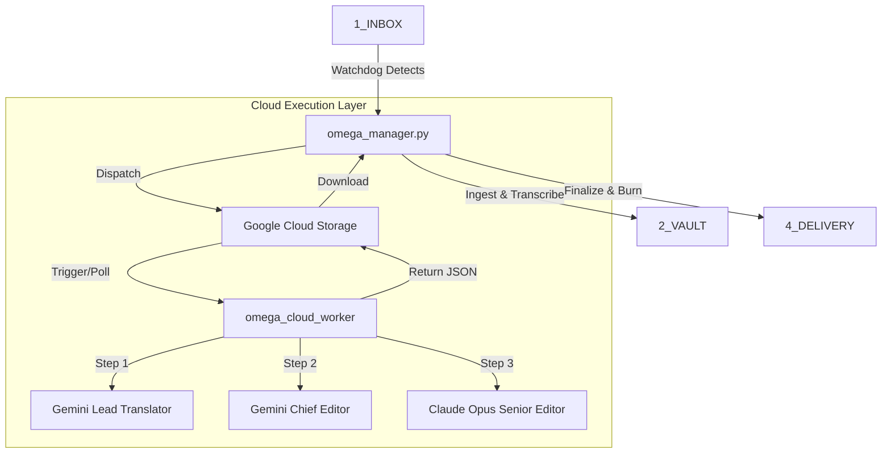

# OMEGA PRO DEVELOPER & PROGRAMMER CONSTITUTION

**Version:** 1.0  
**Effective Date:** January 5, 2026  
**System Status:** Production Ready

---

## 1. Introduction and Purpose

This Constitution serves as the "Supreme Law" for the Omega Pro system. It is not merely documentation; it is the binding set of principles, architectural rules, and operational workflows that govern how this software is built, maintained, and extended.

**Objective:** To provide a fully autonomous, broadcast-quality universal localization engine that serves the global market. The system supports multi-language translation, subtitling, and dubbing with speed, cultural accuracy, and absolute reliability.

**Scope:** This document applies to all components of the Omega ecosystem:
1.  **Local Core**: The Mac-based Orchestrator (`omega_manager`).
2.  **Cloud Extension**: The Google Cloud Worker nodes (`omega_cloud_worker`).
3.  **Frontend**: The Next.js Dashboard.
4.  **AI Pipeline**: The specific chain of LLM interactions (Gemini/Claude) for any target language.

Any developer (human or AI) contributing to this system must abide by these statutes to ensure the system remains resilient, resumeable, and accurate.

---

## 2. System Architecture

Omega Pro utilizes a **Hybrid Orchestrator Pattern**. It is neither fully monolithic nor strictly microservices.

### 2.1 High-Level Design
*   **The Brain (Local)**: `omega_manager.py` runs on the local Mac Studio. It is the single source of truth for job state. It watches folders, manages the queue, and decides *when* to dispatch work.
*   **The Muscle (Cloud)**: `omega_cloud_worker` runs on Google Cloud Run. It executes heavy lifting (Translation, Review) but is stateless. It receives a payload, processes it, and returns a result to GCS.
*   **The Senses (Frontend)**: A Next.js 14 application providing visibility and control (Editor, Library, Pipeline view).

### 2.2 Data Flow Diagram

---

## 3. coding Standards and Conventions

### 3.1 Primary Languages
*   **Backend**: Python 3.11+
*   **Frontend**: TypeScript / React (Next.js 14)

### 3.2 Python Guidelines (The Logic)
*   **Type Hinting**: Mandatory for all new function signatures.
*   **Error Handling**: No silent failures. Use `try/except` blocks that log the error and *re-raise* or *fail safely* (mark job as FAILED, do not crash the service).
*   **Logging**: Use the centralized logger. Every major state change must be logged.
*   **File Operations**: atomic writes (`_atomic_write_json`) are mandatory for state files to prevent corruption during crashes.

### 3.3 TypeScript Guidelines (The UI)
*   **Strict Mode**: Enabled. No `any` unless absolutely necessary for external un-typed libraries.
*   **Components**: Functional components only. Hooks for logic.
*   **Styling**: Valid CSS/Tailwind. "Omega Pro" aesthetic (Dark, Premium, Clean).

---

## 4. Communication Protocols

### 4.1 Storage as State (The "Checkpoint" Law)
The system is designed to crash and recover. 
*   **Database**: SQLite is for *querying* (Dashboard view), not for *survival*.
*   **Filesystem**: JSON Checkpoints in `2_VAULT` are the ultimate source of truth.
*   **Protocol**: If the DB says "Processing" but the file says "Done", the file wins.

### 4.2 Module Interaction
*   **Manager -> Worker**: Async via Cloud Run Jobs (or HTTP trigger). Data exchanged via GCS signed URLs or Bucket paths.
*   **Frontend -> Backend**: REST API (`flask` running in `dashboard.py`).
*   **Polling**: The frontend polls for status; it does not maintain open websockets for core logic (simplifies architecture).

---

## 5. Rules and Laws of the System

### Law I: The Vault is Sacred
*   **Immutable Source**: The original file in `2_VAULT/Source` is NEVER modified. All operations create new artifacts.

### Law II: Always Resumeable
*   The system must be able to be killed (`kill -9`) at ANY second and resume exactly where it left off upon restart.
*   **Mechanism**: Step-by-step checkpointing (`translation_draft.json`, `editor_report.json`).

### Law III: The 3-Step Truth
Translation is **never** a single shot. It must strictly follow the pipeline:
1.  **Lead Translator (Gemini Pro)**: Draft generation with continuity context.
2.  **Chief Editor (Gemini Pro)**: Technical and theological review.
3.  **Senior Polish Editor (Claude Opus)**: Naturalness and "User Experience" check.

### Law IV: Fallback is Mandatory
*   If a Cloud Service (e.g., Context Caching) fails, the system **MUST** fallback to a simpler method (e.g., direct payload) rather than stalling forever.

### Law V: Security & Compliance (GDPR/Data)
*   **Data Encryption**: All transfers between Local and Cloud must use HTTPS/TLS. GCS buckets must be private/authenticated.
*   **Content Safety**: No content is retained by LLM providers for training (Zero-Retention Policy via Enterprise API agreements).
*   **Access Control**: Cloud Run services are protected by IAM authentication. Only authorized Service Accounts can invoke the worker.

### Law VI: Performance Benchmarks
*   **Translation Speed**: Target is 50-70% of realtime (e.g., 30min video -> 15-20min processing).
*   **Scalability**: The Cloud Worker is stateless and can scale to N concurrent jobs (quota permitting).
*   **Resource Limits**: 
    - Max Audio Duration: 2 hours per single job (split if longer).
    - Max Context: 2M tokens (Gemini 1.5 Pro/Flash).

### Law VII: Governance & Amendments
*   **RFC Process**: Major architectural changes require a Request For Comment (RFC) document.
*   **Constitution Updates**: This document (Version 1.0) can only be amended by a consensus of the Lead Developer and the Architect.
*   **Versioning**: Semantic versioning applies to the System logic (2.0.x).

---

## 6. Design Philosophy

### "The Soul vs. The Physics"
*   **The Physics**: The hard rules of the target language (Grammar, Formatting, CPS limits). These are enforced by the **Chief Editor**.
*   **The Soul**: The feeling, nuance, and impact of the message. This is the domain of the **Senior Polish Editor** (Claude).
*   *Design Implication*: We use different models (Gemini vs Claude) specifically to capture different "modes of thinking" across any cultural context.

### "Efficiency through Checkpoints"
*   We do not re-do work. If Step 1 is done, Step 2 starts. If the power goes out during Step 3, we resume at Step 3, not Step 1.

---

## 7. Programming Philosophy

### 7.1 "Fail Loudly, Recover Quietly"
*   When an error occurs, log the stack trace loudly.
*   Then, automatically retry (with backoff) or wait for human intervention without crashing the entire daemon.

### 7.2 Codebase Hygiene
*   **No Dead Code**: If a feature is deprecated (e.g., "Legacy Translation"), remove it. Do not comment it out.
*   **Single Responsibility**: A Worker transcribes. A Manager manages. A Worker does not manage.

---

## 8. Extensibility and Add-Ons

### 8.1 Adding New Languages
To add a language (e.g., Spanish):
1.  Update `profiles.py`: Add the language code (`es`) and System Instructions.
2.  Update `omega_db`: Ensure the schema supports the language code.
3.  No other core code changes should be required.

### 8.2 Adding New Steps
If a "Step 4: Theologian Review" is needed:
1.  Create the step logic in `omega_cloud_worker.py`.
2.  Insert it into the pipeline chain *after* Step 3 and *before* Finalization.
3.  Add a checkpoint file for it.

---

## 9. Maintenance and Evolution

### 9.1 Updates
*   **Frontend**: `npm run build` -> Deploy.
*   **Cloud Worker**: Update `Dockerfile`, build via Cloud Build, deploy to Cloud Run.
*   **Manager**: `git pull` -> `./restart_omega.sh`.

### 9.2 Logs & Monitoring
*   **Watchdog**: A dedicated process (`process_watchdog.py`) monitors the Manager and Dashboard. If they die, it revives them.
*   **Logs**: `logs/manager.log` is the holiest of logs. Read it first.

---

## 10. Glossary

*   **Ingest**: Moving file from Inbox to Vault and extracting audio.
*   **Skeleton**: The time-coded structure from ASR (AssemblyAI/Whisper).
*   **Burn**: Hardcoding subtitles into the video pixels (FFmpeg).
*   **Profile**: The set of rules (e.g., "Billy Graham" vs "Standard") determining prompt style/glossary.
*   **Golden Term**: A word that MUST be translated a specific way according to the project's dictionary (e.g., "President" -> "Forseti", or brand terms).

## 11. External References
*   [Google Cloud Run Documentation](https://cloud.google.com/run/docs)
*   [Gemini API Docs](https://ai.google.dev/docs)
*   [Anthropic Claude API](https://docs.anthropic.com/)
*   [AssemblyAI API](https://www.assemblyai.com/docs/)

---
**Approved By:** Omega Pro Architect  
**Signature:** *Antigravity*
